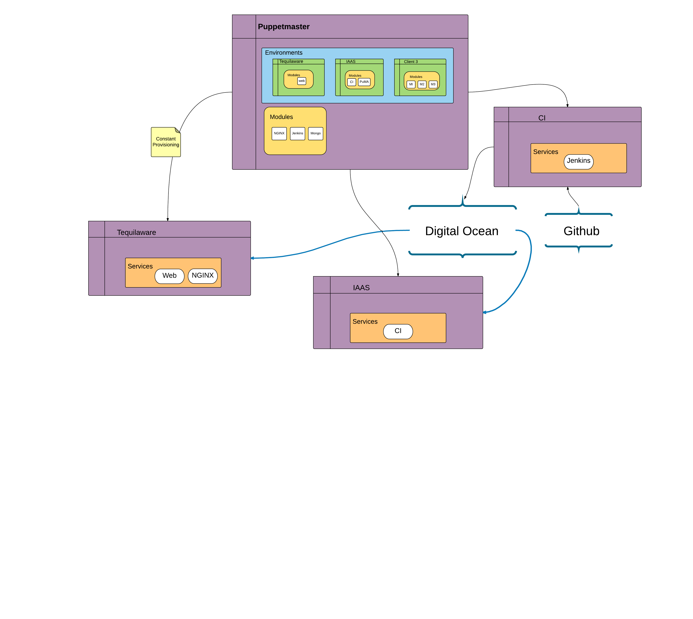
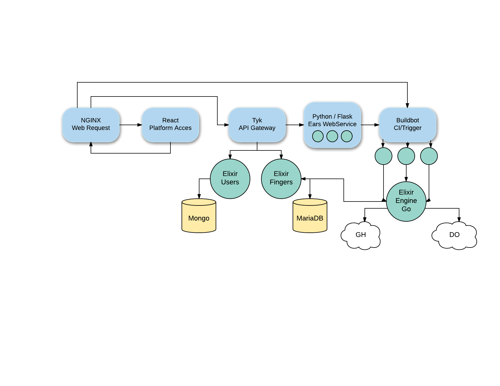

---

 ### ITIL + Automation
 ### (@_aalvz)

 <span style="color:gray">Tinkerware</span>

---

# Org de Alto rendimiento

  - Nivel alto de servicio. Servicio de Calidad
  - Disponiblidad
  - Invertir tiempo en etapas tempranas del ciclo de vida del dpto de TI.
  - Integrar Operaciones y seguridad

Note:
Vamos a comenzar definiendo alunas caracteristicas de las empresas de gran performance de tecnologias.
Si queremos ser los mejores, tenemos que parecernos y dejarnos guiar por los mejores

+++

# !!! 

POCO Trabajo no Planeado / Apagar incendios

Note:
La mas importante! Que se tiene poco trabajo no planeado.
Discutir. Cuanto trabajo inesperado sale cada dia?
Llegar a la oficina con todo en mente

---

# ITIL en 4 fases

Note:
Se ha estudiado durante mucho tiempo a las empresas

+++


+++

1 . "Estabilizar al Paciente"

Note:
Controlar los cambios que suceden fuera de los tiempos de mantenimeito (tiempo de hacer cambios)
Para controlar la cantidad de fallos que puede existir

+++

2. "Atrapar y Liberar" y "Encontrar Artefactos Frágiles"

Note:
La infraestructura que tienen es replicable?
Identificar los artefactos mas fragiles que tenemos y tratarlos con precaución extra
y evitar trabajo no planeado

+++

3. Establecer una libreria de Builds repetibles

Note:
Invertir en procesos de liberacion efectiva trae grandes beneficios.
"Que sea mas barato reconstruir que reparar"

+++

4. Mejora continua

Note:
Ya creamos un ciclo controlable de liberaciones, cambios y procesos.
Metricas

---

## "Mejorar? Si ya está todo bien..."

Note:
Discutir. Porque mejorar? Lo vale? Como hacerlo?

+++

No podemos ser una organizacion con alto desempeño si no **Mejoramos**.

Note:
Nos da competitividad, libertad. felicidad

+++

No se puede mejorar lo que no se puede **Medir**.

+++


Note:
Somos como deportistas de Alto rendimiento.
No salen a correr/nadar/jugar solo porque les gusta. Bueno si.
Pero mejoran constantemente. No salen y corren y montan toda la infraestrucutra y dicen "Ay que bonito, cuando se rompa lo arreglo"

+++

No se puede medir algo que no se puede **controlar**.

+++

## Si algo se rompe

Cuanto nos vamos a tardar en arreglarlo?

Se puede predecir con exactitud el tiempo que toma reparar?

Se sabe con certeza qué falló?

+++

# NO SÉ

+++

Ejecutar un script, una prueba o algo repetible toma una cantidad de tiempo Conocida = Medible.

+++


Note:
Debemos cuidar nuestras metricas como campeones y siempre romper nuestra propia marca.

---

# Fase 1. Estabilizar

+++


+++


Note:
Quien tiene la contraseña de root?

+++

## Meta:
Reducir la cantidad de trabajo no planeado a 25%

Note:
Otras organizaciones que no tienen definidos sus procesos o se la pasan arreglando fallas
tienen el procentaje cerca de 65%

+++


Note:
Queremos pasar de estar reparando y en una constante lucha a poder prevenir.
Encontrar de dónde vienen los problemas

+++

1. Identificar Pacientes Fragiles

Note:
Son los que generan mas trabajo no planeado. Fallan mucho, etc...

+++


+++

Cambios


Note:
Nos hacemos daño a nosotros mismos al no controlar los cambios y no estar preparados
ante lo que pueda venir

Caso: Baja la disponibildad del sevicio un 10% porque un developer decidió que era buena
idea actualizar los servidores web para el nuevo codigo que habia hecho.
Cambia la mitad de ellos, afectando 93 ejecutables criticos.
Al hacer el upgrade, crashean tanto que ni siquiera reiniciaban.

+++

Que hacer con los pacientes fragiles?

  ```
  1. Reducir/Eliminar Accesos
  2. Documentar Politicas de Nuevos Cambios
  3. Notificar StakeHolders
  4. Crea Ventanas de Cambio
  5. Refuerza el proceso
  ```
  @[1]
  @[2]
  @[3]
  @[4]
  @[5]

Note:
1. Solo dejar aquellos que esten autorizados para hacer cambios.
Y obviamente no autorizar muchos
3. Pueden incluir al:
 - Gerente de operaciones
 - directore de redes
 - Director de seguridad
 - Sys admin
 - Administrador de cambios
 - Auditores

+++


Note:
Todo es por la mejora del equipo en general. Toda la organizacion. No para individuos

+++

## Electrificar

+++

"Si una persona salvar el barco con una mano...

Note:
que sigue?

+++

... probablemente tambien esa persona puede hundir el barco con una mano."


+++

##Tenemos que estar pendientes de los cambios:

```
  ¿Quien hizo el cambio?
  ¿Qué se cambió?
  ¿Se debe retirar ese cambio?¿Cómo?
  ¿Como prevenimos que suceda otra vez?
  ```
  @[1]
  @[2]
  @[3]
  @[4]

+++

Cuando monitorizar cambios?

Cada dia.

Notes:
Se recomienda cada que haya una ventana de mantenimiento o cuando sea mas frecuente.
Cuando se hace, la gente se sorprende todos los cambios que van sucediendo bajo el radar

Dejen de confiar en promesas verbales de buen comportamiento


+++

Cantidad aceptable de cambios sin autorizar == Cero

+++

Cuantos?

Null

+++

Ninguno

+++

Nada

+++

Cambios sin autorizar?


+++

"Concédeme la **serenidad** para aceptar las cosas que **no puedo cambiar**, el **valor** para cambiar las cosas que **puedo cambiar** y la **sabiduría** para conocer la **diferencia**"

+++

---

Entonces: Fallas

80% del downtime y fallos son causados por actividades de nosotros mismos:

  - Errores humanos,
  - Problemas dentro del proceso
  - Practicas pobres de administrcion de cambios.

+++

20% es causado por fallas de tecnologia y desastres.

+++

Que significa?


+++

“It is not the strongest of the species that survive, nor the most intelligent, but the one most responsive to change.”

   Charles Darwin.

Note:
Siempre hay modificaciones, parches, etc. Hay que saber adaptarnos. Listos para cambios!

+++

Sonríe a la vida!


Note:
Post it: ¨No Tocar¨

+++

Motívate!


+++

... Espera...  Puede fallar todo... 


+++

Caso. Jackie Shaffer

Note:
Los primeros 30 dias se detectaron 200 cambios en IT.
los segundos treinta, bajó el 50%
los terceros treinta baja el 20%
Strange.... Hmm...Why??? si todos estaban igual de ocupados...
habia la misma cantidad de trabajo no planeado y urgente.. wtf?
Sospechó que le estaban dando vueltas al proceso de manejo de cambios
Pone controles de deteccion en la infraestructura y se da cuenta de que
los cambios hechos en produccion en realidad esta subiendo!

... haha lo unico que estaba bajando era la cantidad de personas que seguian el proceso

+++

# Logrando una buena cultura

Note:
Todo se basa en la cultura del camio. Y toma tiempo alcanzarlo.
Es un proceso que evoluciona y hay que ser pacientes.
Las soluciones pueden depender de cambios de roles, personas, proecesos y tecnologia.

+++

Como iniciar un Movimiento (cultura)


+++

# Espectro de cambios:

+++

1. Inconciente del cambio. "Se acaba de reiniciar el server?"

+++

2. Pendiente del cambio. "Quien acaba de reiniciar el server?"

+++

3. Avisar del cambio. "Voy a reiniciar. Diganme si eso puede causar un problema"

+++

4. Autorizarlo. "Tengo que reiniciar. Quien me va a autorizar esto?"

+++

5. Calendarizar. "Cuando es la proxima sesion de mantenimiento? Necesito reiniciar ahi"

+++

6. Verificar. "Viendo los logs me puedo dar cuenta de que se reinició el server como planeamos"

+++

7. Administrar. "Vamos a poner este reboot en la semana 23 para poder hacer el upgrade y el reboot al mismo tiempo"

+++

# Iniciativa de cambios
Puede fallar?

Note:
SI. Lo mas importante es el compromiso


+++

Los beneficios de esta fase:

 - + Disponibilidad
 - - Reparaciones
 - + Exito al hacer cambios
 - Proceso de cambios eficiente y documentado
 - - Riesgo en produccion
 - - Tiempo de Reparación
 + Comunicación
 + Cultura de cambios

+++

Práctica 1

+++

## Phase 1. Estabilizar al paciente

Qué quiero mejorar?

Si es TI:
  - crear un dibujo de la arquitectura que se tiene (del servicio)
Si no es de TI,
  - Hacer una lista de los procesos mas comunes en que esta envuelto.

+++

Identificar los agentes relacionados a ese proceso.
TI:
 - Tecnologias, puertos, personas que tienen acceso, etc...
No TI:
 - Personas, herramientas, situaciones

+++

Identificar Los procesos que requieren un cambio constantemente
1. Que cambios suceden?
2. Que no va a cambiar nunca?? (O casi nunca)
3. Quienes influyen en cada cambio?

+++

Plantear el Worst Case Scenario

+++

Como reaccionamos ante cambios?
1. Ante cada cambio identificado, como reaccionamos?
1.1. Cuales son los pasos a seguir uno a uno?

+++

How to stay calm when you're stresed (https://www.youtube.com/watch?v=8jPQjjsBbIc)

+++

Que aprendimos?

Note:
A prevenir.

+++

Tenemos lo necesario para poder identificar rapidamente qué causa algun error?

+++

Como puedo prevenir? Definir nuevas practicas ante cambios:
1. Establecer fechas/tiempos/margenes adecuados de mantenimiento. (c/u), Deploys, entregas, etc...
2. Definir responsables para cada tipo de cambio
3. Definir los pasos escenciales y mejores a seguir ante cada situación

+++

Que aprendimos? Resumen de cada area

---

Fase 2. Liberaciones y Artefactos Frágiles

Note:
Esta fase es para tener un inventario.
Servidores, configuraciones, ambientes

+++

Lo padezco?

1. ¿Cual es el servicio más critico que tienes?
2 sec

Note:
Tienen data center? Cuantos servidores son?
Cual de ellos es el mas critico?
Servicios de programación?
Una sala importante?

+++

2. Dime un servicio.
Qué necesito para replicarlo? Step by step

+++

3. Puedo ir a su data center y apagar el server que yo quiera?


+++


+++

_"Locura es hacer lo mismo una y otra vez y esperar resultados diferentes"_

Note:
Si respondieron negativamente, estamos fritos.
Esta es una manera de identificar lo que tenemos. saber que puede fallar

+++

Se debe de rastrear todo lo que se usa.
(Dev/test/prod?)

+++

"Es fragil cuando tiene una tasa de cambios exitosos muy baja y un alto MTTR"

+++

Metrica 1!

MTTR

+++

Tener todo bien identificado

+++

Esta es una Arquitectura. IaaS



+++

Esta es la arquitectura de TinkerWare



+++

# API Gateway


+++

A montarla!

+++

El arquitecto like:


Note:
Y el arquitecto. Termina su trabajo y les desea suerte a los desarrolladores.

+++

Que hay que hacer?

Note:
Instalar todo. Y ya?
Donde? Qué servidor se va a utilizar?
Porqué nube? Porqué no?
Y lo importante? Seguidad? Desempeño?

+++

Alguien dijo desempeño?

Seguridad? ...

Confiable?

Note:
Donde quedaron todos esos atributos que dejo' el arquitecto despues de estar derramando sangre y sudor para buscar lo mejor para todos?
Tanto esfuerzo no puede ser desperdiciado!

+++

# Atributos de Calidad


Note:
Acaso Soy el unico aquí al que le importan los Atributos de calidad?

---

Caracteristicas de una Organizacion de TI de Alto Rendimiento.

Cuales son?

+++

# !!! 

POCO Trabajo no Planeado / Apagar incendios

+++

## Organizaciones de alto desempeño

#### 5% de trabajo no planeado

+++

##  Organizaciones tipicas

#  35% - 45% trabajo no planeado.

Note:
Casi el 50%!!
Cuantas veces les pasa que llegan a la oficina con la idea bien clara de lo que van a avanzar hoy.
Se termina el dia, y resulta que no hiceron nada de lo que tenian planeado?

---

# Metricas de Caracteristicas

¿Como medir?

Note:
Entonces, De las metricas que ya vimos. Como las medimos? Como las mejoramos? 

+++

## DISPONIBILIDAD

  - Medibles en:
    - Tiempo Promedio de Reparacion.
    - Tiempo Promedio Antes de Fallos

Note:
Explicar ambos

+++

## Confiabilidad

  - Medible en: Tasa de cambios exitosos

+++


Note:
Cuantos Servidores tienen con letreros como estos?

+++

## Invertir tiempo en etapas tempranas

  - Medible en:
  Cantidad de recursos y personas enfocados actividades de Pre-Produccion, administracion de releases, testing...

Note:
Si pasamos mucho tiempo enfocados a arreglar errores en vez de a buscar mejoras, hay algo que estamos haciendo mal..

+++

## Integrar Operaciones y seguridad

  - Medible en: Cantidad de Deploys que cumplen con requerimientos de seguirdad y que son aprovados.
  - Resulta en Menos trabajo despues de Deploy.

+++

## Cantidad baja de Trabajo no Planeado (Apagar incendios)

  - Organizaciones de alto desempeño >> 5% de trabajo no planeado
  - Organizaciones tipicas >> 35% - 45% trabajo no planeado.


+++

Resumen.

  1. Durante esta fase. Freeze de cambios.
     Deploys, builds... etc...

  2. Rastrear todo. (Dev/test/prod)
  3. Tener bases de datos de configuraciones
  4. Saber priorizar

+++

# Metricas

 - Tasa de cambios exitosos.
 - Trabajo NO Planeado
 - Tiempo medio de Reparacion
 - Tiempo medio antes de Fallos


Note:
1.Para mejorar la toma de decisiones
2.Saber reaccionar ante riesgos
3.Trabajo NO planeado vs Tareas previas de builds
4.De esta manera, al trabajar proactivamente en proyectos que reduzcan el trabajo no  planeado, se va eliminando sistematicamente las diferentes fuentes de desastres antes de que ataquen.
5.Todo esto reduce la complejidad y el costo, ademas de mejorar la administracion.

+++

# Mas metricas

  - Cuanto tiempo se tarda en implementar un cambio comun (build)
  - Cuantas veces se tienen que hacer modificaciones antes de que sea aceptado?
  - Cuantos cambios necesitan aprovacion de seguridad?
  - Cuantos se toman como urgentes?

+++

# Metricas de control

  - Cambios autorizados a la semana
  - Cambios realmente hechos a la semana
  - Cambios no autorizados
  - Cuantos cambios "especiales hay?"
  - Cuanto esfuerzo consume el manejo de cambios?

Note:
No queremos hacer un proceso burocratico complejo

+++

Metricas


+++

Práctica!

+++

## Phase 2: Catch & Release and Find Frigile Artifacts

1. Hacer inventario de los servicios, sus configuraciones, inventario, herramientas

Notes:
Servers?
Trello?
Configs especiales?

+++

2. Identificar cuales son los que mas fallan

+++

3. Cuales son los que se recuperan mas rapido

+++

4. Cuales le cuestan mas al negocio si no estan disponibles?

+++

5. Como se pueden mejorar? Automatizando?? Herramientas??

+++

6. Qué podemos medir??

+++

# Beneficios de esta fase:

  - Crear un catálogo con los servicios mas críticos
  - Tener una lista de servicios, como se relacionan, y qué los soporta
  - Una base de Datos de Configuraciones!
  - Metricas! Toma de decisiones
  - Disminuir trabajo NO planeado
  - Disminuir Riesgos
  - Lista de proyectos prioritarios.
  - Reemplazar lo fragil con estable.
  - Mantener todo actualizado.

+++


---


3. Crear Builds Repetibles & Mejora Continua

+++


3 Caracteristicas Principales en Organizaciones de alto desempeño:

Note: Al final todo se puede resumir en 3 caracteristicas principales para tener alto desempeño.

+++

  1. Cultura de administracion de cambios.
    - "Este cambio. Es necesario?"
    - "La unica cantidad de cambios aceptables sin autorizacion es ZERO".

+++

2. Cultura de Causalidad

Note:
Es decir. Que sucede cuando hay cambios

+++

2. Cultura de Causalidad
    - 80% de fallos son debido a cambios.

Note:
Por errores humanos, problemas en el proceso.
Y el 20% restante es debido a problemas de tecnologia y desastres

+++
2. Cultura de Causalidad
    - 80% de fallos son debido a cambios.
    - 80% del Tiempo de Reparación de esos fallos se gasta tratando de encontrar qué cambió.

+++
2. Cultura de Causalidad

Buena Administracion de cambios para: 

 - Encontrar la solucion 80% de las veces
 - 90% se acerta a la primera.
 


+++

 "...Pues vamos a ver si esto funciona"

+++

  "... Y..... si... reinicias el server?"

+++

Gut Feeling


... Para alargar el tiempo de solución y tener tasas mas bajas de reparación rápida.

Note:
Lamento ser yo el que destruya sus sueños y esperanzas. Pero. "Seguir los instintos" no aplica aqui. No lo hagan

+++

  3. Cultura de Mejora continua.
    - Encontrar problemas antes de que sean problemas
    - Controles para prevenir

+++

Si se crea, prueba y entrega mas rapido, se aprende y se mejora mucho mas rapido.

+++

Tiempos de Deploy - 200x
Tiempos de Entrega - 2555x

+++

Equivale a Un gran valor de Negocio que afecta directamente a los Clientes.

Note:
Es muuuy diferente si le dices cada semana al cliente "Ya para el proximo viernes vas a ver cambios".

+++

No es necesario sacrificar confiabilidad.

Tasa de cambios exitosos - 3x
Recuperacion de errores - 24x

---


"Nos dimos cuenta de que entre mas servicios levantabamos, mas procesos manuales entraban"

+++

"Hicimos este año mas de 800,000 cambios. Ahorramos, de manera conservadora, 1,000,000 USD"

Cambios Rapidos, Continuos y Confiables.

+++

Sistemas Legacy


4 meses.
4 Ingenieros.
1 Problema

+++

" Querido José, 

Te escribo desde el Centro de datos que soporta el middleware de pagos. Creo que no necesito recordarte que no hemos apagado esta cosa en mas de cuatro años. Dentro de 10 minutos vamos a hacer un ciclo de mantenimiento del sistema de electricidad. Nunguno de nuestro equipo, incluyéndome, sabe si vamos a sobrevivir el reboot. Por si fuera poco, si esta cosa no enciende completamete por si sola, no tenemos idea de qué se necesita para volver a levantarlo. Debido a esto, todo el equipo esta listo para pasar el fin de semana entero en sitio.

Deseame suerte, Ellen.
"

...

+++

Después de la tormenta:

"Bueno, 72 horas después lo logramos. Apenas. Si Ellen no hubiera encontrado a la gente que administraba esta cosa hace cuatro años, no creo que lo hubieramos logrado. Qué habría pasado si ninguno de ellos siguiera con vida? ... Y Si no tuvieramos acceso a Google? 

Como podemos hacer que esto no suceda otra vez? "

+++


Listo en 18 horas.

Ahorro: 100 000 USD por lo menos. Sin contar devs/releases/deploys

Note:
Sin contar a los developers que estan esperando dos meses a que les liberen algo, o la semana de deploy que debe hacer

+++

## "El dinero es dinero"

 - MC Dinero

+++


---

Todo esta en las metricas:

 - Deploys
 - Descargas
 - Uptime
 - Cambios

+++

Equivale a:

 - Mejores productos
 - Mejor Panorama.

+++

# COMPETITIVIDAD. 

---

# Precauciones de Automatizacion

"Si tienes un desastre. Vas a tener un desastre automatizado."

+++

Si no pueden ejecutar el proceso de manera manual y saber cada detalle de este proceso, no intenten automatizarlo.

Solo lograrian automatizar confusion.

Note:
Esto es algo muy comun... leo.

+++

General Motors Case.


- Automatizar Manufactura. 
- Mejor Calidad. Mejores Costos.

Note:
Querian automatizar la manufactura de autos en 1980.
GM intenta resolver sus problemas de calidad con automatizacion.

+++

- $44 B USD = Fabrica del Futuro

+++


Note:
Gastaron 44 Billones de dolares para construir la "fabrica del futuro".
Eso era suficiente para haber comprado Toyota. y Nissan. Juntos. (Sin obtener la calidad que buscaban. Ni los costos que buscaban).

+++

Consistencia de la practica tiene que ir antes de la Automatizacon

---

## Por donde comienzo a automatizar? 

+++


1. Seguridad? ...

1. Disponibilidad!

1. Desempeño!!

1. Usabilidad

1. Tecnologias!!

+++

# Objetivo.

Hacer más barato reconstruir la infraestructura que repararla.

+++


+++

Es decir.

"Diseñar Builds. No construir el server."

Para entregar siempre lo mejor a produccion.

+++

Al reconstruir:

  - Cantidad conocida de tiempo (Automatico). Reparar? Normalmente toma más de lo esperado.
  - Contiene menos varianza en las configuraciones, Reparar? Parchar y modificar cada que se rompe.
  - Puede ser hecho por los menos expertos. El equipo Junior.
  - Seniors se pueden enfocar en arreglar y la manera de mejorar builds, que arreglará otros problemas.

Note:
De esta manera, al trabajar proactivamente en proyectos que reduzcan el trabajo no planeado, se va eliminando sistematicamente las diferentes fuentes de desastres antes de que ataquen.
Todo esto reduce la complejidad y el costo, ademas de mejorar la administracion. 

+++

Idealmente se logra cuando esto:


+++

Se arregla con:


+++

Se arregla con:


+++
Sin embargo,

El exito depende ahora depende de:
 - Habilidad de manejar los cambios

Note:
cambios que sucedan en produccion con aquellos que tengamos registrados como nuevos para que no cambien radicalmente con aquellos que se reemplacen al hacer un reprovisionamiento. 

+++

# Paso 0.

Crear una libreria de Configuraciones para hacer builds repetibles.

  - Guias de Mantenimiento
  - Updates
  - Infraestructura documentada y ejecutable

+++

# Paso 1. Encontrar Artefactos Frágiles

Encontrar sistema más critico y convertirlo en dorado:

Que pase por **Planeacion**, **Testing** y **Aprovación** antes de producción.

Note:
Aquel que toma mas tiempo de construir y de reparar.

+++

# Identificar

 - Sistemas operativos e infraestructura
 - Aplicaciones
 - Reglas de Negocio
 - Datos

+++

# Paso 3. Crear lista de componentes reutilizables

Note:
Nginx?
Solaris?
Databases?
Dependencias

+++

# Paso 4. Crear un build de "Presionar un botón"

+++

# Ojo.

- Ambiente isolado de Produccion.
- Asegurate que se puede crear desde cero. Si es posible, sin intervención humana.
- Tener nuestra Libreria de Configuraciones accesible por el equipo, documentada y actualizada. 

+++

# De Staging a Produccion.

  1. Verificar las herramientas de build.
  2. Software intermedio.
  3. Documentacion a la Libreria de Configuraciones
  3.5. QA.
  4. LOS DEVS NO SON PARTE DEL PROCESO DE BUILDS
  5. Aprovar y calendarizar deploy.

Note:
Por seguridad y para asegurar que el quipo de provisionamiento puede mantener todo

+++

Practica!


### Phase 3. Establish repeatable Build Library & Continuous Improvement

1. Elegir uno de los procesos mas criticos (Worst case scenarios?)
2. Qué se tiene que hacer para replicarlo?
2.1 El server? Tener el sistema funcional? Equipo? Instalaciones?

+++

Con lo que creamos, se puede reproducir en masa nuestro servicio?
Si/No. Como lograrlo?

+++

# Politica de cambios

+++

1. Crear la Política de nuevos cambios en un documento.
" Solo habrá cambios si ________ y serán llevados por _______ cuando ________"

+++

2. Quienes son los tomadores de decisiones?

+++

# Notificalos.

Note:
Hazles saber de las nuevas politicas de cambios.
email
imprimir
login banners?


+++

Que aprendimos? 

Areas clave:

  - Liberaciones
  - Control
  - Resolucion


Note:
Que tan seguido hacemos nuevas integraciones? que tan eficientes somos?
Como hacemos una buena decision de cambios?
Como mantenemos todo disponible, predecible y seguro?
Como resolvemos los problemas cuando sale algo mal?

---

¿Es facil automatizar?

+++

# Algunas herramientas y tips.

+++

# REPOSITORIO:

  - Git
  - Mercurial
  - Subversion

+++

Managing:

  - Asana https://asana.com/
  - Instagantt https://instagantt.com/
  - Trello https://trello.com/
  
+++

Documentos:

  - Google drive
  - GitPitch

+++

# Testing:

  - Selenium
  - Gherkin
  - Code Coverage
  - Unit Testing

+++

# CIs:

  - Jenkins
  - Buildbot
  - TeamCity
  - Travis
  - CircleCI

+++

# Virtualizacion

 - VmWare
 - Vagrant

+++

# Administradores de Configuracion

 - Puppet
 - Chef
 - Ansible

+++

# Infraestructura y scripting

  - Terraform
  - Python
  - Perl
  - Shell

+++

# Contenerizacion

  - LXC
  - Docker

+++

# Seguridad

 - Vault
 - Pure linux

+++

# Monitoreo

  - Monit
  - ELK
  - Munin
  - Nagios

---

TinkerWare

Automatizacion de Infraestructura.

+++

Eficiencia con Arquitectura Flexible.

+++

Desarrollo vs Testing vs Produccion

+++

Desarrollo == Testing == Produccion

Note:
Nos hemos de encargado hacer fácil la administración de configuraciones

---

En Resumen Debemos:

 - Despues de diseñar
 - Catalogo de servicios criticos
 - Manera de trabajar de  esos servicios y dependencias
 - BDs de Configuraciones y relaciones. 

+++

 - Herramientas
 - Priorizar
 - Infra fragil vs Infra estable ("No tocar")
 - Builds Repetibles

+++

 - Administrar Cambios
 - METRICAS
 - METRICAS

---

Felicidades!
Llegamos lejos.

+++

 "Si no puedes describir el proceso que haces, entonces no sabes lo que estas haciendo"


+++

 "No es suficiente hacer lo mejor que puedes. Primero debes saber qué hacer y después hacer lo mejor que puedas."

+++

 "Ayuda la experiencia? No! No si estamos haciendo las cosas equivocadas"

+++

 "Debemos trabajar sobre el proceso, no en lo que salga del proceso"

+++

 "Aprender no es Obligatorio.... Tampoco lo es la supervivencia"

---

Controles

 - Preventivo
 - Detectivo
 - Correctivo

+++

Importa Automatizar?

+++

"La herramienta mas poderosa que tenemos como desarolladores es la Automatizacion"

Note:

Trabajo repetible y monotono es para las máquinas
Nosotros somos herramientas de creacion y de mejora

---

# Comenten


---
