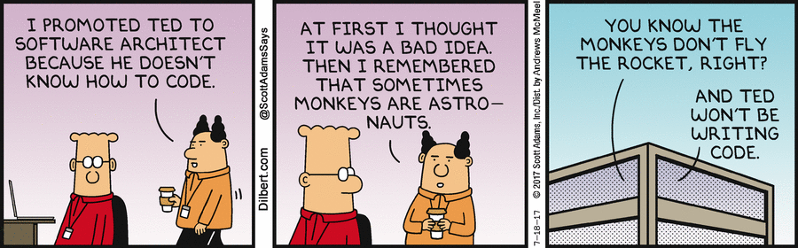
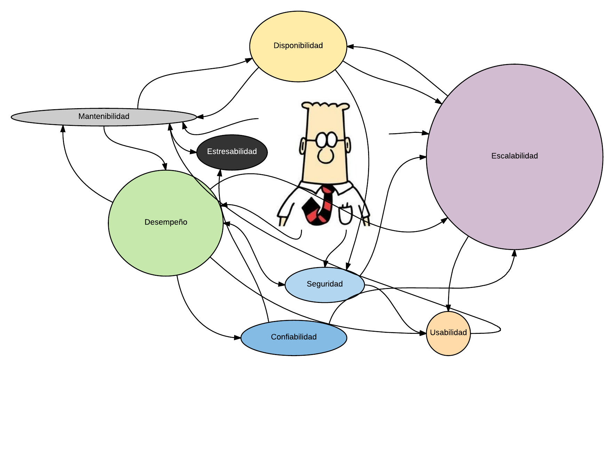
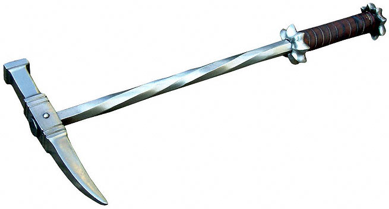
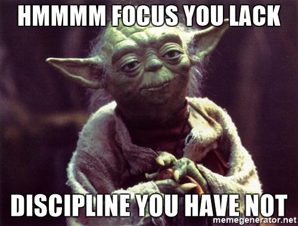
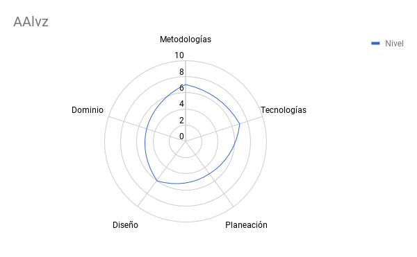

---

 ### Arquitectura Automatizable
 ### (@_aalvz)
 ### (GH: AgusRumayor)

 Tinkerware

---

## ¿Soy arquitecto de software?

+++

## Subes cosas al repositorio?
### Entonces... lo más probable es que sí.

+++

+++

#### Puntos que ve un arquitecto (QA)

---

## Habilidades de un arquitecto de software

* Metodologías
* Tecnologías
* Planeación
* Diseño
* Dominio

+++

## Metodologías
#### SCRUM, Kanban-lean, RUP, PSP, XP, FDD.......

+++

## Tecnologías
* Lenguajes? 2? 4? 8? 12?
* Frameworks?
* APIs

+++

## Planeación

+++

## Diseño
* Diagramas
* UML
* CCCC (Contexto/Contenedores/Componentes/Clases)
* AWS/Google

+++

## Dominio

+++

+++

---

## Estilos ----> Patrones
## Patrones -----> Tecnologías

+++

## Estilos

+++

## Patrones

+++

## Tecnologías

---

