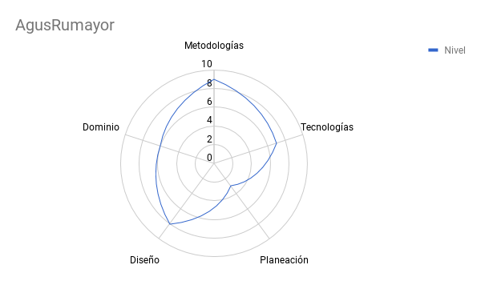

---

 ### Arquitectura Automatizable
 ### (@_aalvz)
 ### (GH: AgusRumayor)

 Tinkerware

---

## ¿Soy arquitecto de software?

+++

## Subes cosas al repositorio?
### Entonces... lo más probable es que sí.

+++

### ¿Cuándo y en qué puntos se hace arquitectura?

+++

## Puntos que ve un arquitecto
* Escalabilidad
* Seguridad
* Disponibilidad
* Mantenibilidad
* Desempeño
* Confiabilidad
* Usabilidad
* Estresabilidad

---

## Habilidades de un arquitecto de software

* Metodologías
* Tecnologías
* Planeación
* Diseño
* Dominio

+++

## Metodologías

+++

## Tecnologías

+++

## Planeación

+++

## Diseño

+++

## Dominio

+++

+++

---

## Estilos/Patrones/Tecnologías

+++

## Estilos

+++

## Patrones

+++

## Tecnologías

---

---

## Por qué Automatizar la arquitectura?

Post it: ¨No Tocar¨

---

# Recap

En este punto;

 - Creamos un catalogo de servicios que documentan los servicios mas criticos que tenemos
 - Documentamos como trabajan esos servicios en la infraestructuras y qué componentes los mantienen

Debemos:

 - Tener una base de datos de configuraciones para mapear los servicios y sus relaciones.
 - Tener metricas y herramientas PARA mejorar la toma de decisiones
 PARA incrementar la tasa de cambios existosos y PARA disminuir trabajo NO planeado.
 - Creamos una lista de proyectos prorizados PARA reemplazar artefactos fragiles con infraestructura estable.
 - Identificar artefctos frágiles con tasas bajas de exito después de cambios y que tengan un alto índice de MTTR (Media Time To Recover) ya que contribuyen al trabajo no planeado. Y todos ellos estan llenos de post its de ¨No tocar¨.
 - Ahora tenemos que crear builds repetibles, Focus en infra fragil.
    - Definir mecanismos de builds
    - Documentacion estable y actualizable
    - Imagenes de sistema.

 De aqui resulta un proceso repetible para construir infraestructura desde cero.

Al hacer la infraestructura mas facil  de reconstruir y reparar atacamos varios puntos;
  1. Si algo sale mal en produccion, no lo reparamos, en lugar de eso, nos quitamos el problema de encima y reprovisionamos desde cero. Sin embargo, en este punto, el exito depende completamente de nuestra habilidad de manejar los cambios que sucedan en produccion con aquellos que tengamos registrados como nuevos para que no cambien radicalmente con aquellos que se reemplacen al hacer un reprovisionamiento. 

- Tasas altas de server/admin
- Baja cantidad de Trabajo No Planeado
- Habilidad para mantener y administrar cambios en configuraciones. 

Reemplazar Trabajo NO planeado por tareas previas 

El punto es pover nuestro Senior IT Operations de una posicion reactiva y de lucha contra incendios a un rol proactivo de funciones de administracion de releases en donde trabajan constantemente en integrar los releases que van a ser entregados a produccion.

De esta manera, se trabaja en operaciones tempranas del ciclo de vida de desarrollo, en donde el costo por errores es mucho mas bajo.

Asi, el principal rol del equipo de administracion de releases es construir los mecanismos para hacer el mejor deploy con las mejores configuraciones a produccion. Asi ellos no hacen los builds. Hacen Ingenieria de los builds. Es decir, los diseñan, pero no construyen el server.

OBJETIVO: Que sea mas barato reconstruir la infraestructura que repararla. Al presionar un solo boton.

Los siguientes beneficios son los mas importantes resultado de reconstruir en vez de reparar:

  - Reconstruir es una tarea que tiene tiempos muy especificos, medibles y por lo tanto mejorables. En cambio reparar fallos, SIEMPRE tiene un tiempo impredecible y normalmente toma mas tiempo de lo que estimamos.
  - Reconstruir infraestructura, implementa menos variabildad en la confuguracion, al contrario de lo que es un ciclo constante donde algo se rompe y se repara, lo que agrega mucha varianza en la configuracion y despues se vuelve complicado adentrarse.
  - Al tener un proceso automatizado de reconstruccion, documentado y menos complicado, incluso puede ser hecho por los Juniors, liberando aun Senior de ese trabajo, enfocandose a algo de mayor importancia e incluso de lucha contra incendios.
  - Al liberar a un senior (despues de arreglar fallos) pueden seguir trabajando en nuevos proyectos y sus builds, lo que arreglara otros problemas ligados.

De esta manera, al trabajar proactivamente en proyectos que reduzcan el trabajo no  planeado, se va eliminando sistematicamente las diferentes fuentes de desastres antes de que ataquen.

Todo esto reduce la complejidad y el costo, ademas de mejorar la administracion. 
