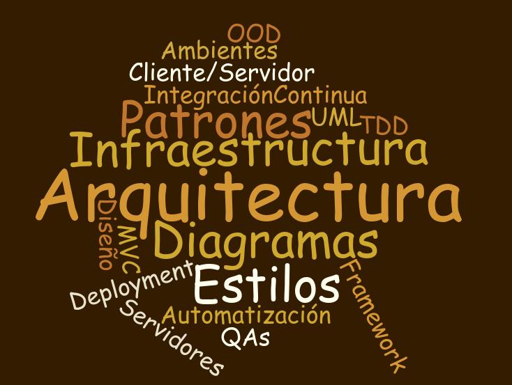

---

 ### Arquitectura Automatizable
 ### (GH: AgusRumayor)
 ### (@_aalvz)

 Tinkerware

---

## ¿Soy arquitecto de software?

+++

## Subes cosas al repositorio?
### Entonces... lo más probable es que sí.

+++

### ¿Cuándo y en qué puntos se hace arquitectura?

+++

## Puntos que ve un arquitecto
* Escalabilidad
* Seguridad
* Disponibilidad
* Mantenibilidad
* Desempeño
* Confiabilidad
* Usabilidad
* Estresabilidad

---

## Habilidades de un arquitecto de software

* Metodologías
* Tecnologías
* Planeación
* Diseño
* Dominio

+++

## Metodologías

+++

## Tecnologías

+++

## Planeación

+++

## Diseño

+++

## Dominio

+++

+++

---

## Estilos/Patrones/Tecnologías

+++

## Estilos

+++

## Patrones

+++

## Tecnologías

---

---

## Por qué Automatizar la arquitectura?

---

Esta es una Arquitectura. TW. Explicar.

---

A montarla!

---

El arquitecto like:

Notes:
Y el arquitecto. Termina su trabajo y les desea suerte a los desarrolladores.

---

Que hay que hacer?

Notes:
Instalar todo. Y ya?
Donde? Qué servidor se va a utilizar?
Porqué nube? Porqué no?
Y lo importante? Seguidad? Desempeño?

---

Alguien dijo desempeño?

Seguridad? ...

Confiable? 

---

# Atributos de Calidad

Notes:
Acaso Soy el unico aquí al que le importan los Atributos de calidad?

---

Caracteristicas de una Organizacion de TI de Alto Rendimiento.

Cuales son?

---

---

# Org de Alto rendimiento

  - Nivel alto de servicio. Servicio de Calidad
  - Disponiblidad
  - Invertir tiempo en etapas tempranas del ciclo de vida del dpto de TI.
  - Integrar Operaciones y seguridad

---

# !!! 

POCO Trabajo no Planeado / Apagar incendios

---

# Organizaciones de alto desempeño

  5% de trabajo no planeado

---

#  Organizaciones tipicas

  35% - 45% trabajo no planeado.

Notes:
Casi el 50%!!

---

## Porque automatizar??

No podemos ser una organizacion con alto desempeño si no mejoramos.

---

No se puede mejorar lo que no se puede medir.

---

Notes:
Somos como deportistas de Alto rendimiento.
No salen a correr/nadar/jugar solo porque les gusta. Bueno si.
Pero mejoran constantemente. No salen y corren y montan toda la infraestrucutra y dicen "Ay que bonito, cuando se rompa lo arreglo"

---

No se puede medir algo que no se puede controlar.

---

Ejecutar un script, una prueba, algo repetible toma una cantidad de tiempo medible.

---

Pero si algo se rompe y queremos descubrir qué fue lo que sucedió.

Se puede predecir con exactitud el tiempo que toma reparar?

Se sabe con certeza qué falló?

---

Notes:
Debemos cuidar nuestras metricas como campeones y siempre romper nuestra propia marca.

---

# Metricas de Caracteristicas

Como medir? 

Notes:
Entonces, De las metricas que ya vimos. Como las medimos? Como las mejoramos? 

---
## DISPONIBILIDAD
  - Medibles en:
    - Tiempo Promedio de Reparacion.
    - Tiempo Promedio Antes de Fallos

Notes:
Explicar ambos

---
## Confiabilidad
  - Medible en: Tasa de cambios exitosos

---

Notes:
Cuantos Servidores tienen con letreros como estos?

---

## Invertir tiempo en etapas tempranas del ciclo de vida del dpto de TI.
  - Medible en: Cantidad de recursos y personas enfocados actividades de Pre-Produccion, administracion de releases, testing...

Notes:
Si pasamos mucho tiempo enfocados a arreglar errores en vez de a buscar mejoras, hay algo que estamos haciendo mal..

---

## Integrar Operaciones y seguridad
  - Medible en: Cantidad de Deploys que cumplen con requerimientos de seguirdad y que son aprovados.
  - resulta en Menos trabajo despues de Deploy.

---

## Cantidad baja de Trabajo no Planeado (Apagar incendios)
  - Organizaciones de alto desempeño >> 5% de trabajo no planeado
  - Organizaciones tipicas >> 35% - 45% trabajo no planeado.

---

3 Caracteristicas comunes en Organizaciones de alto desempeño:

Notes: Al final todo se puede resumir en 3 caracteristicas principales para tener alto desempeño.

---

  1. Cultura de administracion de cambios.
    - "Este cambio. Es necesario?"
    - "La unica cantidad de cambios aceptables sin autorizacion es ZERO".

---

2. Cultura de Causalidad

Notes:
Es decir. Que sucede cuando hay cambios

---

2. Cultura de Causalidad
    - 80% de fallos son debido a cambios.

Notes:
Por errores humanos, problemas en el proceso.
Y el 20% restante es debido a problemas de tecnologia y desastres

---
2. Cultura de Causalidad
    - 80% de fallos son debido a cambios.
    - 80% del Tiempo de Reparación de esos fallos se gasta tratando de encontrar qué cambió.

---
2. Cultura de Causalidad

Tener una buena administracion de cambios, ayuda a encontrar una posible solucion al problema mas del 80% de las veces, acertando el  90% de las veces a la primera.

---

 "...Pues vamos a ver si esto funciona"

---

  "... Y..... si... reinicias el server?"

---

Gut Feeling

... Para alargar el tiempo de solución y tener tasas mas bajas de reparación rápida.

Notes:
Lamento ser yo el que destruya sus sueños y esperanzas. Pero. "Seguir los instintos" no aplica aqui. No lo hagan

---

  3. Cultura de Mejora continua.
    - Encontrar problemas antes de que sean problemas
    - Controles para prevenir

---

Entonces: Fallas

80% del downtime y fallos son causados por actividades de nosotros mismos:

  - Errores humanos,
  - Problemas dentro del proceso
  - Practicas pobres de administrcion de cambios.

---

20% es causado por fallas de tecnologia y desastres.

---

Que significa?

Notes:
Post it: ¨No Tocar¨

---

Motívate!

---

Bendiceme universo!!

---

"Automatizar no da valor directo a mis clientes o a mi empresa"

Notes:
Boom. Golpe directo de realidad.
Quien esta de acuerdo con esta frase? 

---

Falso

Note:
Hacer Pruebas, automatizacion, nos da velocidad.
---

Si se crea, prueba y entrega mas rapido, se aprende y se mejora mucho mas rapido.

---

Tiempos de Deploy - 200x
Tiempos de Entrega - 2555x

---

Equivale a Un gran valor de Negocio que afecta directamente a los Clientes.

---

No es necesario sacrificar confiabilidad.

Tasa de cambios exitosos - 3x
Recuperacion de errores - 24x

---

"Nos dimos cuenta de que entre mas servicios levantabamos, mas procesos manuales entraban"

---

"Hicimos este año mas de 800,000 cambios. Ahorramos, de manera conservadora, 1,000,000 USD"

Cambios Rapidos, Continuos y Confiables.

---

Sistemas Legacy

4 meses.
4 Ingenieros.
1 Problema

---

" Querido José, 

Te escribo desde el Centro de datos que soporta el middleware de pagos. Creo que no necesito recordarte que no hemos apagado esta cosa en mas de cuatro años. Dentro de 10 minutos vamos a hacer un ciclo de mantenimiento del sistema de electricidad. Nunguno de nuestro equipo, yo incluida, sabe si vamos a sobrevivir el reboot. Por si fuera poco, si esta cosa no enciende completamete por si sola, no tenemos idea de qué se necesita para volver a levantarlo. Debido a esto, todo el equipo esta listo para pasar el fin de semana entero en sitio.

Deseame suerte, Ellen.
"

+++

Después de la tormenta:

"Bueno, 72 horas después lo logramos. Apenas. Si Ellen no hubiera encontrado a la gente que administraba esta cosa hace cuatro años, no creo que lo hubieramos logrado. Qué habría pasado si ninguno de ellos siguiera con vida? ... Y Si no tuvieramos acceso a Google? 

Como podemos hacer que esto no suceda otra vez? "

---

Listo en 18 horas.

Ahorro: 100 000 USD por lo menos. Sin contar devs/releases/deploys

Notes:
Sin contar a los developers que estan esperando dos meses a que les liberen algo, o la semana de deploy que debe hacer

---

## "El dinero es dinero"

 - MC Dinero

---

---

Todo esta en las metricas:

 - Deploys
 - Descargas
 - Uptime
 - Cambios

---

Equivale a:

 - Mejores productos
 - Mejor Panorama.

---

# COMPETITIVIDAD. 

---

# Precauciones de Automatizacion

"Si tienes un desastre. Vas a tener un desastre automatizado."

---

Si no pueden ejecutar el proceso de manera manual y saber cada detalle de este proceso, no intenten automatizarlo.

Solo lograrian automatizar confusion.

Notes:
Esto es algo muy comun... leo.

---

General Motors Case.

- Automatizar Manufactura. 
- Mejor Calidad. Mejores Costos.

---

- $44 B USD = Fabrica del Futuro

Notes:
Querian automatizar la manufactura de autos en 1980.
GM intenta resolver sus problemas de calidad con automatizacion.
Gastaron 44 Billones de dolares para construir la "fabrica del futuro".
Eso era suficiente para haber comprado Toyota. y Nissan. Juntos. (Sin obtener la calidad que buscaban. Ni los costos que buscaban).

---

Consistencia de la practica tiene que ir antes de la Automatizacon

---

## Por donde comienzo a automatizar? 

---

1. Seguridad? ...

1. Disponibilidad!

1. Desempeño!!

1. Usabilidad

1. Tecnologias!!

---

Objetivo.

Hacer más barato reconstruir la infraestructura que repararla.

---

Priorizar en base al cliente

---

---

Es decir.

"Diseñar Builds. No construir el server."

Para entregar siempre lo mejor a produccion.

---

Al reconstruir:

  - Es un proceso automatizado. Toma una cantidad conocida de tiempo. Al contrario de reparar, que normalmente toma más de lo esperado.
  - Contiene menos varianza en las configuraciones, al contraro de reparar cada que se rompe.
  - Puede ser hecho por los menos expertos. El equipo Junior.
  - Seniors se pueden enfocar en arreglar y la manera de mejorar builds, que arreglará otros problemas.

Notes:
De esta manera, al trabajar proactivamente en proyectos que reduzcan el trabajo no planeado, se va eliminando sistematicamente las diferentes fuentes de desastres antes de que ataquen.
Todo esto reduce la complejidad y el costo, ademas de mejorar la administracion. 

---

Idealmente se logra cuando esto:

---

Se arregla con:

---

Se arregla con:

---
Sin embargo,
El exito depende ahora depende de:
 - Habilidad de manejar los cambios

Notes:
cambios que sucedan en produccion con aquellos que tengamos registrados como nuevos para que no cambien radicalmente con aquellos que se reemplacen al hacer un reprovisionamiento. 

---

# Paso 0.

Crear una libreria de Configuraciones para hacer builds repetibles.

  - Guias de Mantenimiento
  - Updates
  - Infraestructura documentada y ejecutable

---

# Paso 1. Encontrar Artefactos Frágiles

Encontrar sistema más critico y convertirlo en dorado:

Que pase por **Planeacion**, **Testing** y **Aprovación** antes de producción.

Notes:
Aquel que toma mas tiempo de construir y de reparar.

---

# Identificar

 - Sistemas operativos e infraestructura
 - Aplicaciones
 - Reglas de Negocio
 - Datos

---

# Paso 3. Crear lista de componentes reutilizables

Notes:
Nginx?
Solaris?
Databases?
Dependencias

---

# Paso 4. Crear un build de "Presionar un botón"

---

# Ojo.

- Ambiente isolado de Produccion.
- Asegurate que se puede crear desde cero. Si es posible, sin intervención humana.
- Tener nuestra Libreria de Configuraciones accesible por el equipo, documentada y actualizada. 

---

# De Staging a Produccion.

  1. Verificar las herramientas de build.
  2. Software intermedio.
  3. Documentacion a la Libreria de Configuraciones
  3.5. QA.
  4. LOS DEVS NO SON PARTE DEL PROCESO DE BUILDS
  5. Aprovar y calendarizar deploy.

Notes:
Por seguridad y para asegurar que el quipo de provisionamiento puede mantener todo

---

¿Es facil automatizar?

---

# Algunas herramientas y tips.

---

# REPOSITORIO:

  - Git
  - Mercurial
  - Subversion

---

# Testing:

  - Selenium
  - Gherkin
  - Code Coverage
  - Unit Testing

---

# CIs:
  - Jenkins
  - Buildbot
  - TeamCity
  - Travis
  - CircleCI

---

# Virtualizacion

 - VmWare
 - Vagrant

---

# Administradores de Configuracion

 - Puppet
 - Chef
 - Ansible

---

# Infraestructura y scripting

  - Terraform
  - Python
  - Perl
  - Shell

---

# Contenerizacion

  - LXC
  - Docker

---

# Seguridad

 - Vault
 - Pure linux

---

# Monitoreo

  - Monit
  - ELK
  - Munin
  - Nagios

---

TinkerWare

Automatizacion de Infraestructura (Arquitectura)

---

En Resumen Debemos:

 - Despues de diseñar
 - Crear un catalogo de servicios que documentan los servicios mas criticos que tenemos
 - Documentamos como trabajan esos servicios y qué componentes los mantienen
 - Tener una base de datos de configuraciones para mapear los servicios y sus relaciones.

+++

- Herramientas
 - Priorizar
 - Infra fragil vs Infra estable ("No tocar")
 - Builds Repetibles

+++

 - Administrar Cambios
 - METRICAS
 - METRICAS

---

# Metricas

 - Tasa de cambios exitosos.
 - Trabajo NO Planeado
 - Tiempo medio de Reparacion
 - Tiempo medio antes de Fallos

Notes:
1.Para mejorar la toma de decisiones
2.Saber reaccionar ante riesgos
3.Trabajo NO planeado vs Tareas previas de builds
4.De esta manera, al trabajar proactivamente en proyectos que reduzcan el trabajo no  planeado, se va eliminando sistematicamente las diferentes fuentes de desastres antes de que ataquen.
5.Todo esto reduce la complejidad y el costo, ademas de mejorar la administracion.

---
